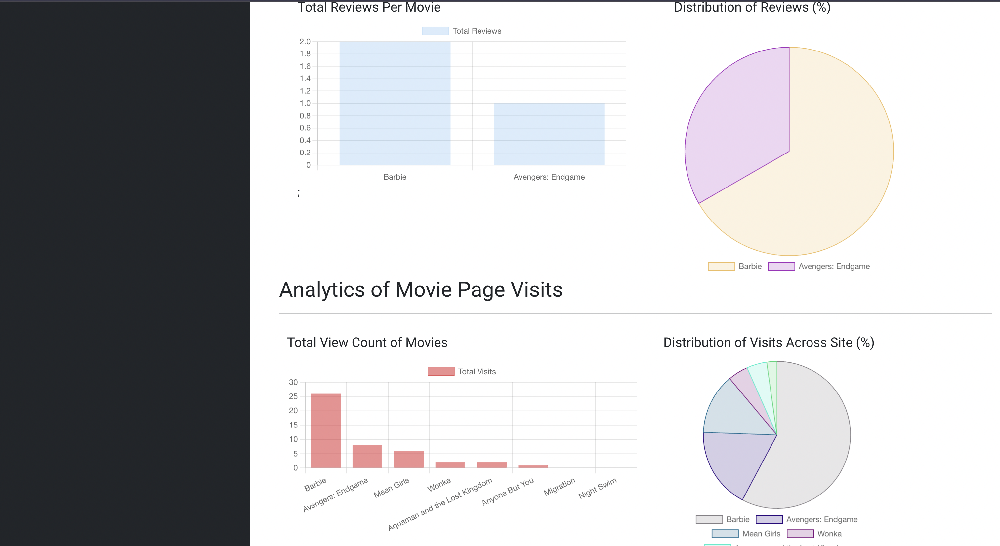

<!-- Improved compatibility of back to top link: See: https://github.com/othneildrew/Best-README-Template/pull/73 -->

<a name="readme-top"></a>

<!--
*** Thanks for checking out the Best-README-Template. If you have a suggestion
*** that would make this better, please fork the repo and create a pull request
*** or simply open an issue with the tag "enhancement".
*** Don't forget to give the project a star!
*** Thanks again! Now go create something AMAZING! :D
-->

<!-- PROJECT SHIELDS -->
<!--
*** I'm using markdown "reference style" links for readability.
*** Reference links are enclosed in brackets [ ] instead of parentheses ( ).
*** See the bottom of this document for the declaration of the reference variables
*** for contributors-url, forks-url, etc. This is an optional, concise syntax you may use.
*** https://www.markdownguide.org/basic-syntax/#reference-style-links
-->

[![Contributors][contributors-shield]][contributors-url]
[![Forks][forks-shield]][forks-url]
[![Stargazers][stars-shield]][stars-url]
[![Issues][issues-shield]][issues-url] [![MIT License][license-shield]][license-url] [![LinkedIn][linkedin-shield]][linkedin-url] <!-- PROJECT LOGO --> <br /> <div align="center"> <a href="https://github.com/LukeMacdonald/loop-cinema">  </a> <h3 align="center">LOOPCINEMA</h3> <p align="center"> <br />
<a href="https://github.com/LukeMacdonald/loop-cinema"><strong>Explore the docs »</strong></a>
<br />
<br />

  </p>
</div>

<!-- TABLE OF CONTENTS -->
<details>
  <summary>Table of Contents</summary>
  <ol>
    <li>
      <a href="#about-the-project">About The Project</a>
      <ul>
        <li><a href="#built-with">Built With</a></li>
      </ul>
    </li>
    <li>
      <a href="#getting-started">Getting Started</a>
      <ul>
        <li><a href="#prerequisites">Prerequisites</a></li>
        <li><a href="#installation">Installation</a></li>
      </ul>
    </li>
    <li><a href="#usage">Usage</a></li>
    <li><a href="#roadmap">Roadmap</a></li>
    <li><a href="#contributing">Contributing</a></li>
    <li><a href="#contact">Contact</a></li>
  </ol>
</details>

<!-- ABOUT THE PROJECT -->

## About The Project

<div class="row" align="center">
    
    
</div>

LOOPCINEMA is a dynamic web platform designed to streamline the movie-going experience for users by offering convenient ticket booking services and an interactive platform for sharing movie reviews and recommendations. With a user-friendly interface and robust features, LOOPCINEMA aims to become the go-to destination for cinephiles and casual movie enthusiasts alike.

<p align="right">(<a href="#readme-top">back to top</a>)</p>

### Built With

<div style="column-count: 2; -webkit-column-count: 2 -moz-column-count: 2;">

- [![JavaScript][JavaScript-badge]][JavaScript-url]
- [![GraphQL][GraphQL-badge]][GraphQL-url]
- [![MySQL][MySQL-badge]][MySQL-url]
- [![React][React.js]][React-url]
- [![Redux][Redux-badge]][Redux-url]
- [![TailwindCSS][TailwindCSS-badge]][TailwindCSS-url]
- [![Bootstrap][Bootstrap-badge]][Bootstrap-url]
- [![NodeJS][NodeJS-badge]][NodeJS-url]
- [![ExpressJS][Express.JS-badge]][ExpressJS-url]

</div>

<p align="right">(<a href="#readme-top">back to top</a>)</p>

<!-- GETTING STARTED -->

### Prerequisites

This is an example of how to list things you need to use the software and how to install them.

- npm
  ```sh
  npm install npm@latest -g
  ```

### Installation

1. Clone the repo
   ```sh
   git clone https://github.com/LukeMacdonald/loop-cinema.git
   ```
2. Install NPM packages for projects `server`, `site`, `admin` and `admin-server`
   ```sh
   npm install
   ```
3. Edit database connection configuration inside `server/database/config/config.json` and `admin-server/src/database/config.js`
4. Run `server`, `site`, `admin` and `admin-server`

   ```sh
   npm run start
   ```

      <p align="right">(<a href="#readme-top">back to top</a>)</p>
   <!-- USAGE EXAMPLES -->

## Usage

#### Movie Booking System


LOOPCINEMA enables users to effortlessly browse through a diverse selection of movies, view showtimes, and reserve tickets for their preferred screenings.

#### User Reviews and Ratings


Users have the opportunity to share their thoughts and opinions on movies they've watched through the platform's review and rating system. By fostering a community-driven approach, LOOPCINEMA encourages users to engage with one another, exchange recommendations, and contribute to the platform's vibrant movie discussion ecosystem.

#### Website Analytics

<div class="row">


</div>

The Admin Portal of LOOPCINEMA serves as a comprehensive tool for administrators to monitor and analyze key metrics related to user engagement and website performance.

- Admins can access real-time data on the total number of reservations made through the website for various movie screenings.
- Admins have visibility into the total number of reviews submitted for each movie available on LOOPCINEMA.
- Administrators can monitor audience engagement levels, track user interactions, and identify high-traffic movies to inform promotional strategies and content curation efforts.

<p align="right">(<a href="#readme-top">back to top</a>)</p>

<!-- ROADMAP -->

## Roadmap

- [x] Signin & Signup
  - [x] Implement redux to simplify authentication
- [x] Profile Page
  - [x] Display user details
  - [x] Implement edit details
  - [x] Display booked reservations
- [x] Movie Reservation
- [x] Movie Reviews
- [x] Admin Portal
  - [x] Retreive metrics for (total reservations, reviews posted for movies, total traffic to movies)
  - [x] Implement block user
  - [x] Implement movie management

See the [open issues](https://github.com/LukeMacdonald/loop-cinema/issues) for a full list of proposed features (and known issues).

<p align="right">(<a href="#readme-top">back to top</a>)</p>

<!-- CONTRIBUTING -->

## Contributing

Contributions are what make the open source community such an amazing place to learn, inspire, and create. Any contributions you make are **greatly appreciated**.

If you have a suggestion that would make this better, please fork the repo and create a pull request. You can also simply open an issue with the tag "enhancement".
Don't forget to give the project a star! Thanks again!

1. Fork the Project
2. Create your Feature Branch (`git checkout -b feature/AmazingFeature`)
3. Commit your Changes (`git commit -m 'Add some AmazingFeature'`)
4. Push to the Branch (`git push origin feature/AmazingFeature`)
5. Open a Pull Request

<p align="right">(<a href="#readme-top">back to top</a>)</p>

## Contact

Luke Macdonald - lukemacdonald21@gmail.com.com

Project Link: [https://github.com/LukeMacdonald/loop-cinema](https://github.com/LukeMacdonald/loop-cinema)

<p align="right">(<a href="#readme-top">back to top</a>)</p>

<!-- MARKDOWN LINKS & IMAGES -->
<!-- https://www.markdownguide.org/basic-syntax/#reference-style-links -->

[contributors-shield]: https://img.shields.io/github/contributors/LukeMacdonald/loop-cinema.svg?style=for-the-badge
[contributors-url]: https://github.com/LukeMacdonald/loop-cinema/graphs/contributors
[forks-shield]: https://img.shields.io/github/forks/LukeMacdonald/loop-cinema.svg?style=for-the-badge
[forks-url]: https://github.com/LukeMacdonald/loop-cinema/network/members
[stars-shield]: https://img.shields.io/github/stars/LukeMacdonald/loop-cinema.svg?style=for-the-badge
[stars-url]: https://github.com/LukeMacdonald/loop-cinema/stargazers
[issues-shield]: https://img.shields.io/github/issues/LukeMacdonald/loop-cinema.svg?style=for-the-badge
[issues-url]: https://github.com/LukeMacdonald/loop-cinema/issues
[license-shield]: https://img.shields.io/github/license/LukeMacdonald/loop-cinema.svg?style=for-the-badge
[license-url]: https://github.com/LukeMacdonald/loop-cinema/blob/master/LICENSE.txt
[linkedin-shield]: https://img.shields.io/badge/-LinkedIn-black.svg?style=for-the-badge&logo=linkedin&colorB=555
[linkedin-url]: https://linkedin.com/in/luke-macdonald-292a4a208
[product-screenshot]: images/screenshot.png
[JavaScript-badge]: https://img.shields.io/badge/javascript-%23323330.svg?style=for-the-badge&logo=javascript&logoColor=%23F7DF1E
[JavaScript-url]: https://developer.mozilla.org/en-US/docs/Web/JavaScript
[TailwindCSS-badge]: https://img.shields.io/badge/tailwindcss-%2338B2AC.svg?style=for-the-badge&logo=tailwind-css&logoColor=white
[TailwindCSS-url]: https://tailwindcss.com/
[React.js]: https://img.shields.io/badge/React-20232A?style=for-the-badge&logo=react&logoColor=61DAFB
[React-url]: https://reactjs.org/
[NodeJS-badge]: https://img.shields.io/badge/node.js-6DA55F?style=for-the-badge&logo=node.js&logoColor=white
[NodeJS-url]: https://nodejs.org/en
[Express.js-badge]: https://img.shields.io/badge/express.js-%23404d59.svg?style=for-the-badge&logo=express&logoColor=%2361DAFB
[ExpressJS-url]: https://expressjs.com/
[MySQL-badge]: https://img.shields.io/badge/mysql-%2300f.svg?style=for-the-badge&logo=mysql&logoColor=white
[MySQL-url]: https://www.mysql.com/
[Bootstrap-badge]: https://img.shields.io/badge/Bootstrap-563D7C?style=for-the-badge&logo=bootstrap&logoColor=white
[Bootstrap-url]: https://getbootstrap.com
[Redux-badge]: https://img.shields.io/badge/redux-%23593d88.svg?style=for-the-badge&logo=redux&logoColor=white
[Redux-url]: https://redux.js.org/
[GraphQL-badge]: https://img.shields.io/badge/-GraphQL-E10098?style=for-the-badge&logo=graphql&logoColor=white
[GraphQL-url]: https://graphql.org/
